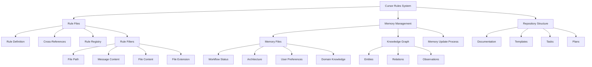

# Project Architecture Memory

## Current Architecture

## Cursor Rule Relationships

This diagram shows the relationships between individual rule files, organized by functional categories. Arrows indicate where one rule references or depends on another.

```mermaid
graph TD
    %% Define rule nodes grouped by categories
    subgraph "Foundational Rules"
        memory[memory-management]
        cursor_rules[cursor-rules-creation]
        date[date-consistency-enforcer]
        rule_index[00-rule-index]
    end

    subgraph "Workflow Rules"
        ai_agile[ai-agile-workflow]
        dev_workflow[development-workflow]
        changeset[changeset-workflow]
        ci_cd[ci-cd-workflow]
        code_review[code-review-standards]
    end

    subgraph "Tool Integration"
        mcp_tools[mcp-tools-usage]
        vibe_tools[vibe-tools]
        anthropic[anthropic-chain-of-thought]
    end

    subgraph "Coding Standards"
        ts_patterns[typescript-patterns]
        api_design[api-design-standards]
        eslint[eslint-config-usage]
        prettier[prettier-config-usage]
        testing[testing-practices]
    end

    subgraph "Repository Structure"
        monorepo[monorepo-structure]
        dependency[dependency-management]
        repo_analyzer[repo-analyzer]
    end

    subgraph "Rule Management"
        rule_ack[rule-acknowledgement]
        rule_recommender[repo-rule-recommender]
        rule_automation[rule-automation-script]
        debugging[debugging-guide]
        user_pref[user-preferences-awareness]
    end

    %% Define key relationships between rules
    %% Foundational relationships
    memory -->|provides context for| ai_agile
    memory <-->|bidirectional| mcp_tools
    memory -->|provides format for| user_pref
    memory -->|relies on| date
    memory -->|links using| cursor_rules

    cursor_rules -->|updates| rule_index
    cursor_rules -->|informs| rule_recommender
    cursor_rules -->|guides| rule_automation

    date -->|used by| ai_agile
    date -->|used by| memory

    %% Workflow relationships
    ai_agile -->|references| memory
    ai_agile -->|uses| date
    ai_agile -->|updates| rule_index
    ai_agile -->|uses| anthropic
    ai_agile -->|uses| mcp_tools

    dev_workflow -->|relates to| changeset
    dev_workflow -->|relates to| ci_cd
    dev_workflow -->|relates to| code_review
    dev_workflow -->|relates to| testing

    changeset <-->|bidirectional| ci_cd
    changeset <-->|bidirectional| monorepo
    changeset -->|informs| code_review

    code_review -->|checks| ts_patterns
    code_review -->|checks| api_design
    code_review -->|checks| eslint
    code_review -->|checks| prettier
    code_review -->|checks| testing

    %% Tool integration relationships
    mcp_tools <-->|bidirectional| anthropic
    mcp_tools <-->|bidirectional| user_pref
    mcp_tools -->|used by| date
    mcp_tools <-->|bidirectional| vibe_tools

    vibe_tools -->|powers| repo_analyzer
    vibe_tools -->|provides| mcp_tools

    %% Coding standards relationships
    ts_patterns <-->|bidirectional| eslint
    ts_patterns -->|informs| api_design
    ts_patterns -->|guides| testing

    eslint <-->|bidirectional| prettier

    %% Repository structure relationships
    monorepo <-->|bidirectional| dependency
    monorepo <-->|bidirectional| eslint
    monorepo <-->|bidirectional| prettier
    monorepo <-->|bidirectional| testing

    repo_analyzer -->|helps in| debugging

    %% Rule management relationships
    user_pref -->|aligns with| ts_patterns
    user_pref -->|aligns with| code_review
    user_pref -->|aligns with| api_design
    user_pref -->|connects to| vibe_tools

    rule_ack -->|references| rule_index
    rule_ack -->|connects to| cursor_rules

    rule_recommender -->|uses| repo_analyzer
    rule_recommender -->|references| cursor_rules
    rule_recommender -->|updates| rule_index
```

## Key Components

- **Cursor Rules System**: The core system for defining AI behavior rules and enforcing consistent practices
  - Based on .mdc files in the .cursor/rules directory
  - Includes rule triggering, filtering, and suggestion mechanisms
  - Supports patterns for file paths, message content, and contextual awareness

- **Memory Management**: System for maintaining context across conversations
  - Memory files for persistent storage in docs/memory directory
  - Knowledge graph integration for entity and relationship tracking
  - Memory update protocols for maintaining consistency

- **Repository Structure**: Organization of the monorepo
  - Documentation organized in docs/ directory
  - Plans, tasks, and templates for workflow management
  - Packages organized in packages/ directory with clear responsibilities

- **Rule Filters**: System for specific rule triggering based on context
  - File path patterns for document-specific rules
  - Message content patterns for conversational triggers
  - File content patterns for code-specific guidance
  - File extension patterns for language-specific rules
  - Word boundaries and specific phrases to reduce false positives

## Integration Points

- **Cursor Rules and Memory Management**: Rules reference memory files and memory files document rule relationships
  - memory-management.mdc rule provides guidance for memory file creation and maintenance
  - Memory files store information about rule relationships and hierarchy
  - Mermaid diagrams in both systems provide visual reference

- **Task Management and Memory**: Workflow status memory tracks task progress
  - Task files define implementation steps
  - Workflow status memory provides current state
  - Recent updates in memory files capture progress
  - Memory files maintain context for AI assistants working on tasks

- **Rule Filters and Content**: Specific patterns trigger rules in appropriate contexts
  - File path patterns activate document-specific rules
  - Message content patterns respond to specific user questions
  - File content patterns provide language-specific guidance
  - Rules combine multiple filter types for precise activation

## Technical Decisions

| Decision | Rationale | Date | Alternatives Considered |
|----------|-----------|------|-------------------------|
| All cursor rules in .cursor/rules | Consistent location, easy discovery | 2025-04-23 | Distributed across packages, centralized outside of .cursor |
| Memory files in docs/memory | Centralized location for context retention | 2025-04-24 | Per-package memory files, no explicit memory |
| mdc: prefix for rule file links only | Clear distinction of links in rule files, works with Cursor IDE | 2025-04-25 | Regular markdown links for all files, custom syntax for all files |
| Always update memory files after task completion | Ensure consistent and current context | 2025-04-26 | Manual updates only, separate automated system |
| Filter patterns with word boundaries | Reduce false positives in rule activation | 2025-05-06 | Simple keyword matching, complex NLP patterns |

## Implementation Guidelines

- All cursor rules must be placed in the `.cursor/rules` directory
- All memory files must be placed in the `docs/memory` directory
- Rule files must use the `.mdc` extension
- Memory files must use the `.md` extension
- Links in .mdc files must use the mdc: syntax (e.g., `[text](mdc:path/to/file)`)
- Links in regular markdown files (.md) must use standard markdown links (e.g., `[text](/path/to/file)`)
- Memory files must be updated after task completion
- Architecture decisions must be documented in this file
- Rule filters should use word boundaries (`\b`) around common terms to reduce false positives
- Rules should combine multiple filter types (file_path, message, content) for precise activation
- File extension patterns should be as specific as possible (e.g., `\.tsx?$` instead of `.ts`)
- Message patterns should include specific phrases and question formats users might ask

## Constraints

- Memory files must be in the docs/memory directory
- Memory files must follow standardized templates
- All cross-references must use the mdc: syntax
- Memory files should be updated after significant changes
- Knowledge graph should be kept in sync with memory files
- Rule filters must be specific enough to avoid false positives
- Filter patterns should use word boundaries when matching common terms
- Each rule should have at least two filter types for reliable activation

## Updated: 2025-05-06
