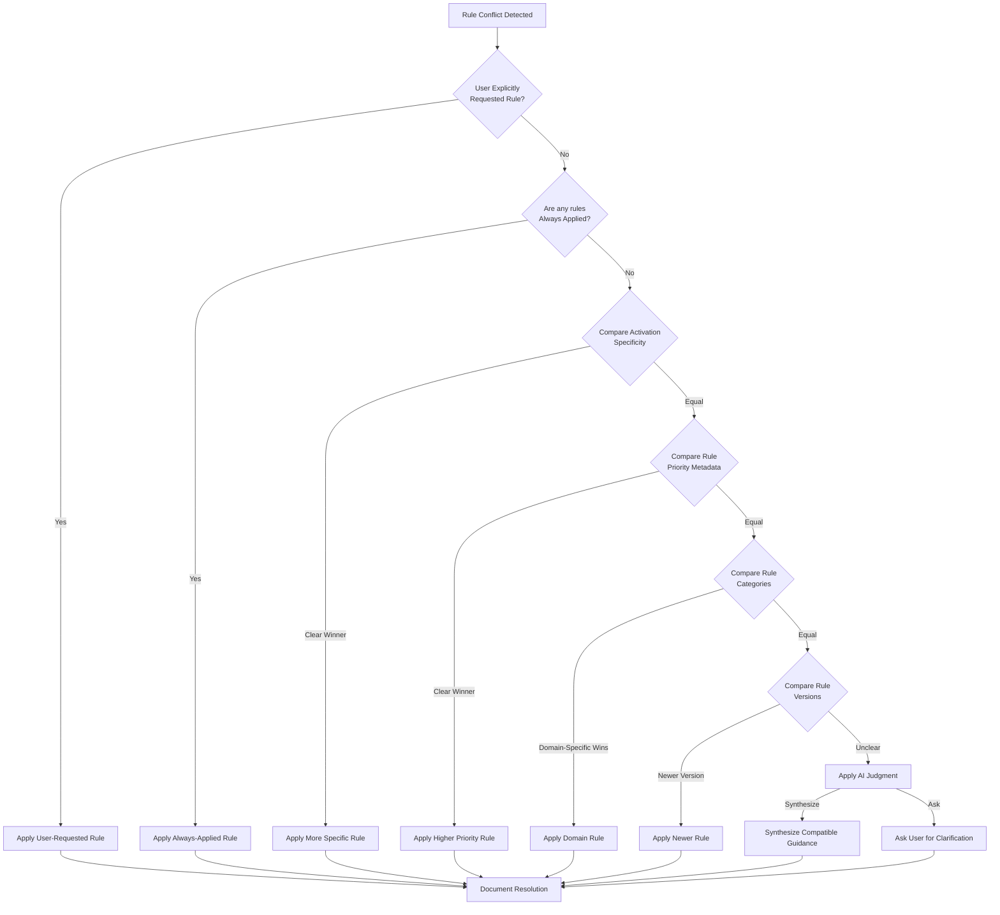
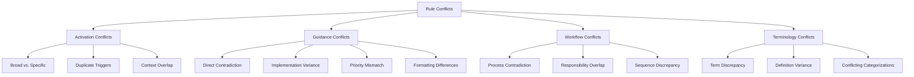

# Cursor Rules Conflict Resolution Guide

This guide provides comprehensive instructions for identifying, analyzing, and resolving conflicts between Cursor rules. It establishes clear principles and practical strategies to help AI assistants and rule creators navigate situations where multiple rules may apply or provide contradictory guidance.

## What Constitutes a Rule Conflict?

A rule conflict occurs when two or more Cursor rules:

1. **Activation Conflict**: Are triggered by the same context (file, message, etc.)
2. **Guidance Conflict**: Provide contradictory or inconsistent instructions
3. **Precedence Conflict**: Both appear applicable, but it's unclear which should take priority
4. **Redundancy Conflict**: Provide duplicate or overlapping guidance, creating noise
5. **Implementation Conflict**: Suggest different implementation approaches for the same goal

Unlike software conflicts that cause system failures, rule conflicts primarily affect consistency, predictability, and quality of AI assistance.

## Conflict Identification

### Detection Methods

1. **Manual Review**: Comparing rule activation conditions and guidance during creation and updates
2. **Usage Testing**: Testing rule activation with representative samples
3. **Conflict Scanning**: Analyzing patterns such as:
   - Similar glob patterns across multiple rules
   - Overlapping message/content patterns
   - Same file types with different guidance
   - Related functionality areas with differing recommendations

### Types of Conflicts

#### 1. Activation Conflicts

Occur when multiple rules are triggered by the same context. Sub-types include:

- **Broad vs. Specific**: A general rule (all .ts files) and a specific rule (only in /src/components)
- **Duplicate Triggers**: Multiple rules using the same or very similar activation patterns
- **Context Overlap**: Rules with different primary triggers that both activate in certain scenarios

#### 2. Guidance Conflicts

Occur when multiple applicable rules provide different or contradictory advice:

- **Direct Contradiction**: Rule A says "always use X" while Rule B says "never use X"
- **Implementation Variance**: Both rules address the same issue but recommend different approaches
- **Priority Mismatch**: Rules that suggest different orders of operations
- **Formatting Differences**: Rules that suggest different code styles or document structures

#### 3. Workflow Conflicts

Occur when multiple rules define aspects of development workflows:

- **Process Contradiction**: Different rules outline conflicting processes
- **Responsibility Overlap**: Multiple rules claim ownership over the same workflow area
- **Sequence Discrepancy**: Rules suggest different sequences for the same process

#### 4. Terminology Conflicts

Occur when rules use inconsistent terminology:

- **Term Discrepancy**: Different terms for the same concept
- **Definition Variance**: Same term with different meanings
- **Conflicting Categorizations**: Rules that categorize concepts differently

## Conflict Resolution Hierarchy

When conflicts arise, follow this hierarchical approach to determine which rule should take precedence:

### 1. Explicit User Invocation

**Principle**: User intent overrides automatic rule activation
- If the user explicitly requests or references a specific rule, that rule takes precedence
- This can be a direct request (e.g., "Apply the typescript-patterns rule") or a link

### 2. Always-Applied Foundation Rules

**Principle**: Core infrastructure rules provide the base framework
- Rules configured with `alwaysApply: true` provide fundamental context
- They rarely conflict directly with context-specific rules
- Examples: cross-reference syntax, memory management basics

### 3. Activation Specificity

**Principle**: More specific matches take precedence over general ones
- Prioritize in this order:
  1. Exact file path match (`type: file_path` with specific path)
  2. Specific glob pattern (`type: file_path` with narrow glob)
  3. Broader glob pattern (`type: file_path` with wildcards)
  4. File extension match (`type: file_extension`)
  5. Content match (`type: content`)
  6. Message pattern match (`type: message`)
  7. Event-based triggers (`type: event`)

### 4. Metadata Priority

**Principle**: Explicit priority metadata resolves ties
- If activation specificity is equal, consult the `priority` field:
  - `high` > `medium` > `low`
  - If no priority is set, treat as `medium`

### 5. Rule Category Precedence

**Principle**: Certain rule categories naturally take precedence in their domains
- Workflow rules (e.g., `ai-agile-workflow`) govern process
- Coding standards rules govern implementation
- Documentation rules govern documentation format
- Repository structure rules govern file organization

### 6. Recency and Version

**Principle**: Newer guidance often reflects updated understanding
- Higher version numbers generally indicate more recent/refined guidance
- Check rule version when resolving unclear conflicts

### 7. AI Assistant Judgment

**Principle**: Synthesize complementary guidance, highlight true conflicts
- The AI should combine non-contradictory aspects of multiple rules
- For true contradictions, the AI should highlight the conflict and apply the higher precedence rule
- When uncertainty remains, the AI should ask the user for clarification

## Resolution Strategies

### For Activation Conflicts

1. **Refine Filter Patterns**:
   - Make glob patterns more specific to reduce unintended triggers
   - Add content-based conditions to limit when rules apply
   - Example: Change `**/*.ts` to `src/components/**/*.ts`

2. **Consolidate Related Rules**:
   - Merge rules with similar activation conditions
   - Create a comprehensive rule that covers related scenarios
   - Example: Combine separate CSS, SCSS, and Sass rules into a unified styles rule

3. **Hierarchical Organization**:
   - Create parent/child relationships between broad and specific rules
   - General rules defer to specific ones in their domain
   - Example: A general TypeScript rule can reference component-specific rules

### For Guidance Conflicts

1. **Clarity Through Specificity**:
   - Make guidance context-specific rather than universal
   - Use phrases like "When in X context, do Y"
   - Example: "For utility functions, use this pattern; for component props, use that pattern"

2. **Harmonization**:
   - Revise conflicting rules to provide consistent guidance
   - Ensure terminology and recommendations align
   - Document the rationale for the harmonized approach

3. **Explicit Precedence**:
   - Clearly state which guidance takes precedence when
   - Add cross-references between potentially conflicting rules
   - Example: "This rule takes precedence over X when in components directory"

### For Workflow Conflicts

1. **Process Ownership**:
   - Designate a primary rule for each workflow area
   - Other rules should defer to or extend the primary rule
   - Example: All versioning guidance defers to `changeset-workflow`

2. **Integration Points**:
   - Define clear handoff points between workflow rules
   - Document how workflows connect and interact
   - Example: How `testing-practices` fits into `development-workflow`

### For Terminology Conflicts

1. **Glossary Alignment**:
   - Create or reference a shared terminology glossary
   - Ensure consistent term usage across rules
   - Update contradictory terminology

2. **Cross-References**:
   - Add explicit references to canonical definitions
   - Clarify when terms have context-specific meanings
   - Example: "Component (as defined in architecture.md)"

## Example Conflict Scenarios

### Scenario 1: Coding Style Conflict

**Context**: A developer is working on a TypeScript file in the repository.

**Conflict**:
- `typescript-patterns` rule suggests using `const` for all declarations unless reassignment is needed
- `legacy-code-style` rule (hypothetical) suggests using `let` for all variable declarations

**Analysis**:
1. Both rules apply to TypeScript files
2. They provide contradictory guidance on variable declaration
3. `typescript-patterns` is more specific to the language
4. `typescript-patterns` likely has higher priority in metadata

**Resolution Steps**:
1. Check user intent (no explicit request in this case)
2. Neither rule is always-applied
3. Both have similar activation specificity (TypeScript files)
4. Check priority metadata: `typescript-patterns` has `high`, `legacy-code-style` has `medium`
5. Apply `typescript-patterns` guidance due to higher priority
6. Note the conflict to the user and explain the resolution

**Implementation**:
```typescript
// Following typescript-patterns rule (higher priority)
const userData = fetchUserData();
// Instead of:
// let userData = fetchUserData();
```

### Scenario 2: Workflow Process Conflict

**Context**: A developer is completing a task and needs to update memory files.

**Conflict**:
- `ai-agile-workflow` rule outlines steps for updating workflow status
- `memory-management` rule automates memory updates
- `memory-management` rule provides general memory file guidelines

**Analysis**:
1. All three rules are relevant to the context
2. They have different but overlapping scopes
3. No direct contradiction, but potential confusion on process

**Resolution Steps**:
1. Recognize the rules serve complementary purposes
2. `ai-agile-workflow` defines the overall process
3. `memory-management` handles implementation details
4. `memory-management` provides the structural foundation
5. Synthesize guidance from all three rules

**Implementation**:
```markdown
# Task Completion Process

1. Mark task as complete following `ai-agile-workflow` guidelines
2. Allow `memory-management` to update memory files
3. Ensure updates conform to `memory-management` structure
4. Verify workflow status reflects the completed task
```

### Scenario 3: Documentation Format Conflict

**Context**: A developer is documenting a new API.

**Conflict**:
- `api-design-standards` recommends documenting API endpoints in OpenAPI format
- `markdown-documentation` (hypothetical) suggests pure Markdown with code examples

**Analysis**:
1. Both rules apply to API documentation
2. They suggest different documentation formats
3. `api-design-standards` is more specific to APIs
4. Domain-specific rules take precedence over general format rules

**Resolution Steps**:
1. Apply `api-design-standards` for structured API definition
2. Incorporate `markdown-documentation` for narrative explanation
3. Integrate both approaches for comprehensive documentation

**Implementation**:
```markdown
# User API

## Overview

[Narrative documentation following markdown-documentation]

## API Definition

```yaml
# OpenAPI spec following api-design-standards
openapi: 3.0.0
paths:
  /users:
    get:
      description: Retrieves user list
```

## Usage Examples

[Code examples following markdown-documentation]
```

### Example 4: Task Completion vs Custom Process

**Scenario**: A user has completed a task and wants to document it using a custom process, but the memory-management rule has an automatic process for task completion.

**Conflicting Rules**:
- `memory-management` rule automates memory updates
- User's custom documentation process

**Potential Consequences**:
- Redundant documentation
- Inconsistent memory state
- Knowledge graph synchronization issues

**Resolution Strategy**:
1. First apply the user's custom process as requested
2. Then ensure memory-management system is updated
3. Merge duplicate information if needed

**Resolution Example**:
```
User: "I've completed the ESLint rule implementation, but I want to document it with this specific structure..."

## Best Practices for Preventing Conflicts

### For Rule Creators

1. **Scope Clarity**:
   - Define precise activation conditions
   - Specify when a rule should and shouldn't apply
   - Document rule boundaries explicitly

2. **Conflict Analysis**:
   - Before finalizing a rule, compare with existing rules
   - Review the rule index for potential overlaps
   - Test the rule with representative samples

3. **Priority Assignment**:
   - Set appropriate `priority` metadata
   - Document rationale for priority level
   - Consider interactions with related rules

4. **Explicit Relationships**:
   - Document dependencies on other rules
   - Cross-reference related or potentially conflicting rules
   - Clarify rule hierarchies and precedence

5. **Version Management**:
   - Update version numbers appropriately
   - Consider backward compatibility when updating

### For Rule Users (AI Assistants and Developers)

1. **Conflict Detection**:
   - Be alert to multiple activated rules
   - Notice contradictory guidance across rules
   - Identify overlapping but inconsistent advice

2. **Hierarchy Application**:
   - Apply the conflict resolution hierarchy systematically
   - Document which rule took precedence and why
   - Highlight unresolved conflicts

3. **Contextual Integration**:
   - Synthesize compatible guidance from multiple rules
   - Apply rules appropriate to the current context
   - Prioritize user-specific requirements

4. **Conflict Reporting**:
   - Document encountered conflicts
   - Suggest rule improvements to reduce conflicts
   - Help maintain rule system coherence

## Mermaid Diagrams

### Rule Conflict Resolution Flowchart



### Rule Conflict Types



## Related Resources

- [Cursor Rules Creation](/.cursor/rules/cursor-rules-creation.mdc): For rule creation guidance
- [Rule Prioritization](/.cursor/rules/cursor-rules-creation.mdc#rule-prioritization-and-conflict-resolution): Basic prioritization hierarchy
- [Rule Interactions](/docs/memory/rule-interactions.md): Documentation of how rules work together
- [Rule Index](/.cursor/rules/00-rule-index.mdc): Complete listing of all available rules

## Updates and Maintenance

This guidance should be reviewed and updated:
- When new rule categories are introduced
- If conflicts are frequently encountered in practice
- When rule interaction patterns evolve
- As the rule system grows in complexity

## Created: 2025-05-05
