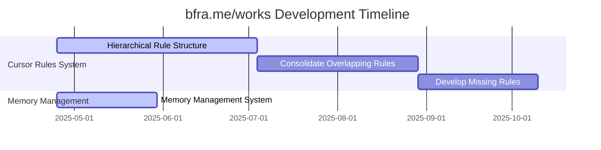

# bfra.me/works Development Plan

This document serves as the hub for all development planning in the bfra.me/works repository.

## Active Projects

### Project 1: Cursor Rules System Improvement

**Objective**: Enhance the Cursor rules system to create a more effective AI-assisted development workflow.

**Status**: In Progress

**Current Phase**: Implementation Phase 1

**Active Tasks**:
- [Task ID: 2025-04-25-01] - Create a relationship diagram for all rules
- [Task ID: 2025-04-25-03] - Create memory management rule

**Upcoming Tasks**:
- [Task ID: 2025-04-25-02] - Define standard linking format
- Create rule registry file
- Add cross-references to each rule

**Related Documents**:
- [Plan: Implement a Hierarchical Rule Structure](plans/cursor-rules-hierarchy.md)
- [Feature: Hierarchical Rule Structure](features.md#feature-1-implement-a-hierarchical-rule-structure-with-cross-references)

### Project 2: Memory Management System

**Objective**: Implement a comprehensive memory management system for enhanced context retention across conversations.

**Status**: In Progress

**Current Phase**: Memory File Structure

**Active Tasks**:
- [Task ID: 2025-04-25-03] - Create memory management rule

**Upcoming Tasks**:
- Define knowledge graph entity types
- Establish relationship mapping
- Create example memory files

**Related Documents**:
- [Plan: Implement Memory Management System](plans/memory-management.md)
- [Feature: Memory Management System](features.md#feature-4-implement-memory-management-system)

## Project Timeline

## Completed Tasks

*No completed tasks yet.*

## Planning Notes

- The next steps for Cursor Rules System Improvement will be to finalize the relationship diagram and propose the standard linking format
- Memory management system implementation has begun with the creation of the memory management rule
- We need to develop a mechanism for tracking completed tasks and updating the plan automatically
- Documentation has been moved from `reference/` to `docs/` for better organization

## Development Process

1. Tasks are derived from plans
2. Plans are created to address features
3. Features are tracked in the features document
4. This plan document provides an overview of all ongoing work
5. AI assistants maintain a workflow status memory file in `docs/memory/workflow-status.md`

## Workflow Status

- **Current Workflow**: AI-Assisted Agile Workflow
- **Last Updated**: 2025-04-25
- **Update Frequency**: Weekly

## References

- [AI-Assisted Agile Workflow Guide](ai-agile-workflow-guide.md)
- [Features Document](features.md)
- [Workflow Status Memory](memory/workflow-status.md)
