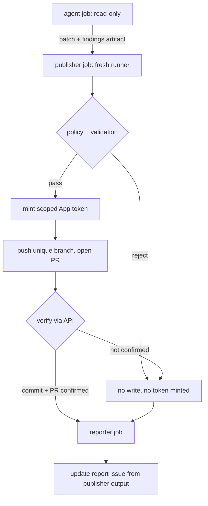

# feat: Autoheal delivery pipeline

## Overview

Restore the daily autohealing workflow's ability to land fixes, using a privilege boundary between the agent that proposes a change and the job that publishes it. Phase 1 (#4321) made the workflow diagnosis-only and stopped it claiming fixes it could not make; this plan gives it a way to actually deliver them.

## Problem Frame

`.github/workflows/fro-bot.yaml` runs a daily LLM agent that diagnoses repository problems. For months its report issue claimed fixes that never landed.

The workflow did not set `output-mode`, so it defaulted to `auto`, which resolves scheduled runs to `working-dir`. In that mode the action instructs the agent that the caller owns diff/commit/push/PR and that `git commit`, `git push`, and `gh pr create` are forbidden. The repository's own prompt told the agent to commit and push. The agent obeyed the action, left changes in the working tree, and the workflow — which had no publish step — discarded them.

Two confirmed losses: a flaky test in `packages/es/test/env/editor.test.ts` that blocked the release pipeline for roughly three months behind 166 changesets, and an `any` removal in `packages/semantic-release/src/types/plugin.d.ts`.

Credentials were never the constraint. Checkout used a push-capable PAT with `persist-credentials` defaulting to true, so the agent could always have pushed. The defect was a contradictory ownership contract with nothing verifying the outcome.

Phase 1 removed the contradiction and the unused credential. The workflow is now honest but inert.

## Requirements Trace

- R1. A fix the agent proposes reaches a reviewable pull request without a human relaying it.
- R2. The report issue cannot state that a fix was delivered unless a commit SHA and PR URL are verified against GitHub.
- R3. The agent job holds no credential capable of mutating the repository.
- R4. A candidate change is validated against policy and the test suite before any write token exists.
- R5. A failed or rejected candidate produces no branch, no commit, and no PR.
- R6. Repeated runs against an unfixed problem do not accumulate duplicate branches or pull requests.

## Scope Boundaries

- Not changing which problems autoheal diagnoses, nor the diagnostic depth of its prompt.
- Not granting the agent job write permissions under any condition.
- Not introducing auto-merge. Published PRs are reviewed and merged manually, consistent with the release workflow after #4285.

### Deferred to Separate Tasks

- Credential isolation for the interactive `@fro-bot` paths (`issue_comment`, `pull_request_review_comment`, `discussion_comment`): separate change, different trust properties from scheduled runs.
- Splitting scheduled autoheal into its own workflow file: worth doing, independent of delivery.

## Context & Research

### Relevant Code and Patterns

- `.github/workflows/fro-bot.yaml` — the workflow. Phase 1 set `output-mode: working-dir` and `persist-credentials: false`, and holds `permissions: contents: read`.
- `.github/workflows/release.yaml` — the pattern to follow for minting a scoped App token immediately before a privileged operation, and for verifying an operation actually happened (`Verify expected publish`).
- `.github/workflows/fro-bot-dispatch-examples.md` — operator-facing examples, rewritten in #4321 to describe diagnosis outcomes.

### Institutional Learnings

- A green workflow run is not evidence that its steps executed. The release pipeline hid a three-month npm outage because the publish step was skipped rather than failed. Any new job must assert its own effect.
- `changeset publish` silently created zero tags when no git identity was configured, because changesets logs its intent before calling git and ignores the exit code. Assume tools misreport success.

### External References

- Architecture review of the discarded mutation-pipeline candidate (commit `64c28825`), which established the privilege-boundary requirement and identified credential multiplication, App-token expiry against an untimed agent step, and arbitrary-branch publication as disqualifying flaws.

## Prior-Art Survey

```json
{
  "schema_version": 2,
  "verdict": "build-new-within-scope",
  "scope": ".github/workflows/",
  "freshness": {
    "vcs_reference": "73b359ff"
  },
  "budget": {
    "max_search_passes": 1,
    "max_candidate_inspections": 2,
    "exhausted": false
  },
  "candidates": [
    {
      "path_or_symbol": ".github/workflows/fro-bot.yaml",
      "description": "Runs the autohealing agent and files a report issue; contains no commit, push, or pull-request step",
      "disposition": "insufficient",
      "insufficiency_reason": "Diagnosis-only by construction after #4321; adding publication to this job would place a write credential in the same process as the agent"
    },
    {
      "path_or_symbol": ".github/workflows/release.yaml",
      "description": "Mints a scoped App token immediately before publishing and asserts the publish occurred",
      "disposition": "extend",
      "insufficiency_reason": "Not reusable directly, but its token-minting and effect-verification patterns are the model for the publisher job"
    }
  ]
}
```

## Key Technical Decisions

- **Three jobs, not one**: the agent cannot hold a credential that the publisher uses. A single job with a late-minted token still exposes it to the agent's process.
- **Validate before minting**: policy checks, patch application, and test runs happen on a fresh runner with no write token. The token is minted only once a candidate has passed.
- **Unique branch per run** (`autoheal/<run-id>/<slug>`): a stable rolling branch couples unrelated fixes, accumulates stale history, races across concurrent runs, and lets an open PR silently absorb unrelated work.
- **Reporter derives status from publisher output**: statuses come from structured job output, never model prose. This is what makes R2 enforceable rather than aspirational.
- **No force-push**: a diverged branch fails the run rather than overwriting.

## Open Questions

### Resolved During Planning

- Should the agent own publication with verification after the fact? No. Verification follows the dangerous operation and cannot contain an agent that has already pushed.
- Should the existing PAT be replaced with an App token? Yes, for the publisher. The agent job needs no credential beyond read access.

### Deferred to Implementation

- The exact policy denylist (paths, file types, size limits): needs calibration against what autoheal actually proposes over a few runs.
- Whether patch transfer between jobs uses artifacts or job outputs: depends on observed patch sizes.
- Whether the reporter should update the existing rolling issue or open per-run issues: current behavior is a rolling issue (#3397) and should be preserved unless it proves unworkable.
- How the new jobs learn the resolved mode: `fro-bot.yaml` currently defines a single job handling review, maintenance, autoheal, and interactive dispatch, with the mode resolved as a step output rather than a job output. The publisher and reporter must run only for autoheal, which likely means promoting the mode to a job-level output and gating on it — or splitting scheduled autoheal into its own workflow, which is already deferred above.

## High-Level Technical Design

> _This illustrates the intended approach and is directional guidance for review, not implementation specification. The implementing agent should treat it as context, not code to reproduce._



## Implementation Units

- [ ] **Unit 1: Agent job emits a structured candidate**

**Goal:** The agent produces a patch and structured findings as job output instead of leaving changes in a discarded working tree.

**Requirements:** R1, R3

**Dependencies:** None

**Files:**

- Modify: `.github/workflows/fro-bot.yaml`

**Approach:**

- Replace the `github-token` input on the agent step for autoheal runs. It currently receives `secrets.FRO_BOT_PAT` (`.github/workflows/fro-bot.yaml:461`) unconditionally, which is push-capable. `persist-credentials: false` on checkout only prevents git from storing the credential; it does not affect a token handed to the agent as an action input, which the agent can use directly.
- Supply a read-scoped token instead, sufficient for reading issues, pull requests, and check logs, and incapable of pushing, opening pull requests, or writing issues. Under this design the agent never needs write access: publication belongs to Unit 3 and issue updates to Unit 4.
- Confirm at implementation time what the action requires of `github-token`, and what scopes autoheal genuinely reads. If a read-only token proves insufficient for some diagnostic path, narrow that path rather than restoring write capability.
- Keep `output-mode: working-dir`, `persist-credentials: false`, and `permissions: contents: read` unchanged.
- After the agent step, capture the working-tree diff and the agent's findings as an artifact.
- Emit base SHA alongside the patch so the publisher can verify it applies to the expected tree.
- Produce no artifact when the tree is clean.

**Patterns to follow:**

- Existing artifact handling in `.github/workflows/` for upload/download shape.

**Test scenarios:**

- Happy path: agent modifies files → artifact contains a non-empty patch, findings, and the base SHA.
- Edge case: agent modifies nothing → no artifact is produced and the job succeeds.
- Edge case: agent modifies only ignored or generated paths → patch is captured as-is; filtering is the publisher's responsibility, not the agent's.
- Error path: agent attempts a push or pull-request creation → the operation fails on credentials, not on instructions alone.
- Integration: the token available to the agent process cannot mutate the repository, verified by attempting a write rather than by reading the configuration.

**Verification:**

- A scheduled run that produces changes leaves a downloadable artifact; a run that produces none does not.
- No credential reachable from the agent job can write to the repository.

- [ ] **Unit 2: Publisher job validates a candidate without write access**

**Goal:** A candidate is fully validated on a fresh runner before any write credential exists.

**Requirements:** R4, R5

**Dependencies:** Unit 1

**Files:**

- Modify: `.github/workflows/fro-bot.yaml`

**Approach:**

- New job, fresh checkout, no App token minted yet.
- Verify the recorded base SHA matches the checked-out tree; abort on mismatch.
- Apply the patch, then reject prohibited paths (`.github/workflows/`, lockfiles, anything executable), unsupported file types, and changes exceeding size limits.
- Run the repository's validation.
- Confirm the resulting diff equals the candidate diff, so validation cannot have altered what gets published.

**Execution note:** Build the rejection paths before the success path — the failure modes are the point of this unit.

**Patterns to follow:**

- `Check NPM_TOKEN` in `.github/workflows/release.yaml` for a fail-fast guard that runs before the operation it protects.

**Test scenarios:**

- Happy path: valid patch against the recorded base → validation passes, job proceeds.
- Error path: base SHA no longer matches → job stops, no token minted.
- Error path: patch touches `.github/workflows/` → rejected with the offending path named.
- Error path: patch exceeds the size limit → rejected.
- Error path: validation fails → job stops, no token minted.
- Edge case: validation mutates files (formatter, lockfile) → diff mismatch is detected and the candidate is rejected.

**Verification:**

- Every rejection path exits before the token-minting step, provable from the job's step conclusions.

- [ ] **Unit 3: Publisher job publishes and verifies**

**Goal:** A validated candidate becomes a reviewable PR, confirmed to exist.

**Requirements:** R1, R5, R6

**Dependencies:** Unit 2

**Files:**

- Modify: `.github/workflows/fro-bot.yaml`

**Approach:**

- Mint a scoped App token immediately before publication, following the release workflow's pattern.
- Push to `autoheal/<run-id>/<slug>`; never force-push.
- Open a PR against the default branch with the findings as the body.
- Verify through the API that the remote branch and the open PR both contain the resulting commit; treat an unverified publish as a failure.
- Emit the commit SHA and PR URL as job output for the reporter.

**Patterns to follow:**

- Token minting and `Setup Git user` in `.github/workflows/release.yaml`.
- `Verify expected publish` in the same file, for asserting an operation's effect rather than trusting its exit code.

**Test scenarios:**

- Happy path: validated candidate → branch pushed, PR opened, commit SHA and PR URL emitted.
- Edge case: same problem recurs on a later run → a new unique branch is used; no existing PR is amended or reused.
- Error path: push rejected → job fails and emits no success output.
- Error path: PR opens but API verification cannot confirm the commit → job fails rather than reporting success.

**Verification:**

- A published fix is reachable from an open PR whose head commit matches the emitted SHA.

- [ ] **Unit 4: Reporter job derives claims from verified state**

**Goal:** The report issue can only claim delivery that actually occurred.

**Requirements:** R2

**Dependencies:** Unit 3

**Files:**

- Modify: `.github/workflows/fro-bot.yaml`

**Approach:**

- New job, the only one permitted to write the report issue.
- Consume the publisher's structured output; do not accept model prose as evidence of delivery.
- Statuses: `published` (verified commit and PR), `rejected` (candidate failed policy or validation), `diagnosis-only` (no candidate produced), `failed` (run did not complete).
- Preserve the existing rolling-issue behavior (#3397).

**Patterns to follow:**

- The report template established in #4321, extended with delivery status.

**Test scenarios:**

- Happy path: publisher succeeded → report shows `published` with the PR URL.
- Happy path: no candidate produced → report shows `diagnosis-only` and the findings.
- Error path: publisher rejected the candidate → report shows `rejected` with the reason and no PR claim.
- Error path: publisher job failed → report shows `failed`; no success language appears.
- Integration: agent prose claiming a fix was applied, with no publisher output → report still shows `diagnosis-only`.

**Verification:**

- No combination of agent output produces a delivery claim without publisher-verified evidence.

## System-Wide Impact

- **Interaction graph:** Scheduled autoheal only. Interactive `@fro-bot` paths are untouched and remain diagnosis-only.
- **Error propagation:** Any failure between the agent and verified publication must surface as a non-success status in the report rather than silence. This is the failure mode that hid the original bug.
- **State lifecycle risks:** Unique per-run branches will accumulate. Cleanup on PR close is not in this plan and should be tracked separately.
- **API surface parity:** None — no published package or public interface changes.
- **Integration coverage:** The agent → publisher → reporter handoff cannot be proven by inspecting any single job. Exercise it end to end on a real scheduled run before trusting it.
- **Unchanged invariants:** `permissions: contents: read` on the agent job, `persist-credentials: false`, and `output-mode: working-dir` all remain as set in #4321.

## Risks & Dependencies

| Risk | Likelihood | Impact | Mitigation |
| --- | --- | --- | --- |
| Prompt injection via issue, PR, or comment text steers the agent's proposed patch | Medium | High | Agent holds no write credential; every candidate passes policy and validation before a token exists |
| Policy denylist proves too permissive in practice | Medium | High | Start restrictive; widen only against observed, reviewed candidates |
| App token expires during a long agent run | Low | Medium | Token is minted in the publisher job, after the agent has finished |
| Unique branches accumulate | High | Low | Track branch cleanup separately; PRs are reviewed and closed manually |
| End-to-end handoff fails in a way no single job reveals | Medium | Medium | Verify on a real scheduled run; treat the first successful delivery as the acceptance gate |

## Documentation / Operational Notes

- `.github/workflows/fro-bot-dispatch-examples.md` describes diagnosis-only outcomes after #4321. Update it once delivery is live, so operator expectations match behavior — the mismatch it currently avoids is the same class of problem this plan exists to fix.
- The first delivered PR should be reviewed with extra care; it is the first output of an automated publisher.

## Sources & References

- Phase 1 containment: #4321
- Discarded mutation-pipeline candidate: commit `64c28825`
- Release workflow patterns: `.github/workflows/release.yaml` (#4285, #4289, #4299, #4310)
- Confirmed dropped fixes: `packages/es/test/env/editor.test.ts`, `packages/semantic-release/src/types/plugin.d.ts`
