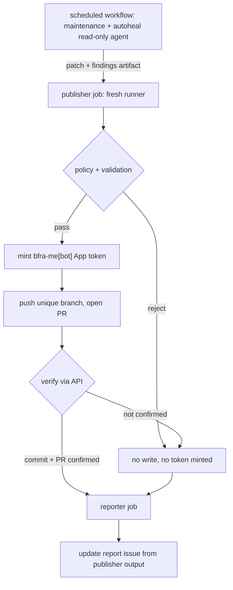

# feat: Scheduled Fro Bot delivery pipeline

## Overview

Restore the single scheduled Fro Bot run's ability to land autohealing fixes while preserving its daily maintenance report, using a privilege boundary between the agent that proposes a change and the jobs that validate, publish, and report it. Phase 1 (#4321) made the workflow diagnosis-only by instruction, but did not remove its push-capable PAT; this plan replaces that ambiguous arrangement with one statically routed, split-privilege scheduled pipeline.

## Problem Frame

`.github/workflows/fro-bot.yaml` currently runs an LLM agent that diagnoses repository problems in review, maintenance, and autoheal modes. Its two schedules resolve to maintenance and autoheal, and for months its report issue claimed fixes that never landed.

The owner now requires exactly one scheduled Fro Bot job. The daily maintenance and autoheal modes therefore move together into `.github/workflows/fro-bot-scheduled.yaml`, with one `30 3` UTC schedule, a bare `workflow_dispatch:` with no inputs, and one combined rolling report. The existing workflow keeps review and interactive paths but loses its schedule trigger and removes its mode input entirely while retaining `prompt`.

The action's `working-dir` mode instructs the agent that the caller owns diff/commit/push/PR. The current autoheal prompt also explicitly forbids modifying files, so the run is diagnosis-only by instruction rather than by enforcement. The workflow has no publisher step, and any candidate that does reach the working tree is discarded.

Two confirmed autoheal losses: a flaky test in `packages/es/test/env/editor.test.ts` that blocked the release pipeline for roughly three months behind 166 changesets, and an `any` removal in `packages/semantic-release/src/types/plugin.d.ts`. The maintenance report must continue to cover repository hygiene alongside code-health findings, even when no code candidate is produced.

Credentials were not removed by Phase 1. Checkout still receives `secrets.FRO_BOT_PAT` as its `token`, and the agent step still receives that PAT as `github-token`; `persist-credentials: false` only prevents checkout from writing the credential into `.git/config`. The agent can still use the PAT directly with `gh`. The defect is diagnosis-only instruction plus no publisher, not an enforced privilege boundary.

Phase 1 made the workflow's diagnosis-only intent explicit, but left the push-capable credential reachable. The scheduled run is therefore still not safely split, and its autoheal path is inert because no step consumes a candidate. The report lifecycle is also currently model-directed; the deterministic reporter must own issue selection and maintenance of the combined rolling report.

## Requirements Trace

- R1. A fix the agent proposes reaches a reviewable pull request without a human relaying it.
- R2. The single combined report issue cannot state that an autoheal fix was delivered unless a commit SHA and PR URL are verified against GitHub.
- R3. The agent job holds no credential capable of mutating the repository.
- R4. A candidate change is validated against policy and the test suite before any write token exists.
- R5. A failed or rejected candidate produces no branch, no commit, and no PR.
- R6. Repeated runs against an unfixed problem do not accumulate duplicate branches or pull requests.
- R7. The single scheduled run emits one combined dated report containing maintenance and autoheal findings, without treating maintenance findings as delivery evidence.

## Scope Boundaries

- Not changing which problems maintenance or autoheal diagnoses, nor the diagnostic depth of either prompt's content.
- Not granting the agent job write permissions under any condition.
- Not introducing auto-merge. Published PRs are reviewed and merged manually, consistent with the release workflow after #4285.

### Deferred to Separate Tasks

- Credential isolation for the interactive `@fro-bot` paths (`issue_comment`, `pull_request_review_comment`, `discussion_comment`): separate change, different trust properties from scheduled runs.
- Cleanup of unique autoheal branches after PR close: separate operational task.

## Context & Research

### Relevant Code and Patterns

- `.github/workflows/fro-bot.yaml` — the existing interactive/review workflow after scheduled maintenance and autoheal move out. It loses its `schedule:` trigger, keeps `pull_request` review, the interactive comment/issue paths, and `workflow_call`, and removes the `mode` input from `workflow_dispatch` while retaining `prompt`. Phase 1 set `output-mode: working-dir` and `persist-credentials: false`, but the workflow still passes the PAT to checkout and the interactive agent.
- `.github/workflows/fro-bot-scheduled.yaml` — the new statically triggered scheduled workflow for both maintenance and autoheal. It will contain the folded read-only agent, validation/publisher, and reporter jobs, plus a bare `workflow_dispatch:` with no inputs.
- `.github/workflows/release.yaml` — the pattern to follow for minting the `bfra-me[bot]` App token immediately before a privileged operation, using `actions/create-github-app-token@bcd2ba49218906704ab6c1aa796996da409d3eb1 # v3.2.0`, `app-id: ${{ secrets.APPLICATION_ID }}`, and `private-key: ${{ secrets.APPLICATION_PRIVATE_KEY }}`, and for verifying an operation actually happened (`Verify expected publish`).
- `.github/workflows/fro-bot-dispatch-examples.md` — operator-facing examples, rewritten in #4321 to describe diagnosis outcomes.
- `marcusrbrown/mrbro.dev/.github/workflows/fro-bot.yaml` — the reference pattern: `live-audit-discovery` runs the read-only agent and emits structured outputs; `live-audit-reporter` is a separate, write-capable job that runs no agent and is gated on discovery success.

### Institutional Learnings

- A green workflow run is not evidence that its steps executed. The release pipeline hid a three-month npm outage because the publish step was skipped rather than failed. Any new job must assert its own effect.
- `changeset publish` silently created zero tags when no git identity was configured, because changesets logs its intent before calling git and ignores the exit code. Assume tools misreport success.
- A read-scoped token is an authorization boundary, not a no-write sandbox. It prevents repository/API mutation, but the action can still write Actions cache and upload artifacts; those are exfiltration and persistent-state channels that require separate controls.

### External References

- Architecture review of the discarded mutation-pipeline candidate (commit `64c28825`), which established the privilege-boundary requirement and identified credential multiplication, App-token expiry against an untimed agent step, and arbitrary-branch publication as disqualifying flaws.
- `marcusrbrown/mrbro.dev/.github/workflows/fro-bot.yaml` — `live-audit-discovery` uses `github-token: ${{ github.token }}`, read permissions, `persist-credentials: false`, and `response-mode: none`; `live-audit-reporter` is a separate write-capable, no-agent job gated on discovery success.

## Prior-Art Survey

```json
{
  "schema_version": 2,
  "verdict": "build-new-within-scope",
  "scope": ".github/workflows/",
  "freshness": {
    "vcs_reference": "73b359ff"
  },
  "budget": {
    "max_search_passes": 1,
    "max_candidate_inspections": 2,
    "exhausted": false
  },
  "candidates": [
    {
      "path_or_symbol": ".github/workflows/fro-bot.yaml",
      "description": "Existing multi-mode workflow runs review, maintenance, and autoheal; its two schedules currently resolve to the latter modes and it contains no commit, push, or pull-request step",
      "disposition": "insufficient",
      "insufficiency_reason": "Both scheduled modes are dynamically routed inside one job, and adding publication there would place a write credential in the same process as the agent. Maintenance and autoheal must move together to a statically triggered scheduled workflow, while review and interactive paths remain here."
    },
    {
      "path_or_symbol": ".github/workflows/release.yaml",
      "description": "Mints the bfra-me[bot] App token immediately before publishing and asserts the publish occurred",
      "disposition": "extend",
      "insufficiency_reason": "Not reusable directly, but its token-minting and effect-verification patterns are the model for the publisher job"
    },
    {
      "path_or_symbol": "marcusrbrown/mrbro.dev/.github/workflows/fro-bot.yaml:live-audit-*",
      "description": "Separates read-only discovery from a write-capable reporter; discovery emits structured job outputs and reporter runs no agent",
      "disposition": "adapt",
      "insufficiency_reason": "The repository's autoheal needs artifact-based candidate transfer and a publisher job, but the static permissions, token, response mode, and no-agent reporter shape are directly applicable"
    }
  ]
}
```

## Key Technical Decisions

- **Both scheduled modes get one workflow file** (`.github/workflows/fro-bot-scheduled.yaml`), rather than remaining as jobs selected from `fro-bot.yaml`. This eliminates the mode-routing blocker instead of solving it with a preflight job, reflects that maintenance and autoheal are one scheduled operational run, and gives both modes static triggers, permissions, credentials, and folded prompt text. The PAT-bearing interactive workflow cannot accidentally receive a scheduled event.
- **Single scheduled cron**: use only `30 3 * * *` (03:30 UTC). Remove the `0 16 * * *` maintenance cron; reducing two scheduled CI runs to one is intentional.
- **Reviewable consequence of the split**: `fro-bot.yaml` loses its `schedule:` trigger and removes its `workflow_dispatch` mode picker and `mode` input entirely while retaining `prompt`. The scheduled workflow has a bare `workflow_dispatch:` with no inputs. Maintenance and autoheal are reachable through that scheduled dispatch entry. With no `mode` input and no `schedule` trigger, `fro-bot.yaml`'s resolution reduces to `pull_request` → review and everything else → interactive, so Oracle's step-output routing blocker stops being a problem and no preflight job is needed there.
- **One combined rolling report issue**: preserve #3397 as the surviving issue, close #2845 with a pointer comment to #3397, and emit one dated section with distinct maintenance and autoheal subsections. Issue selection, title matching, duplicate closing, and 14-day historical-summary compaction currently live in the prompt; Unit 4 moves that responsibility into the deterministic reporter, which owns the single rolling issue and uses one title constant. The agent has `response-mode: none` and must not write issues.
- **Folded scheduled prompt**: merge maintenance and autoheal content into one scheduled prompt without dropping repository-hygiene sections or code-health categories. It must permit local candidate edits and the structured findings file while forbidding pushes, PRs, and issue writes. Correct the stale runtime constraint: most packages target ES2022+/Node.js 20+, but `@bfra.me/eslint-config` requires Node `^22.22.2 || >=24.15.0` and `@bfra.me/create` requires Node `>=22.0.0`, as declared by their `engines` fields.
- **Three jobs, not one**: the agent cannot hold a credential that the publisher uses. A single job with a late-minted `bfra-me[bot]` App token still exposes it to the agent's process.
- **Validate before minting**: policy checks, patch application, and test runs happen on a fresh runner with no write token. The token is minted only once a candidate has passed.
- **Unique branch per run** (`autoheal/<run-id>/<slug>`): a stable rolling branch couples unrelated fixes, accumulates stale history, races across concurrent runs, and lets an open PR silently absorb unrelated work.
- **Reporter derives status from publisher output**: statuses come from structured job output, never model prose. This is what makes R2 enforceable rather than aspirational.
- **No force-push**: a diverged branch fails the run rather than overwriting.
- **Cache isolation is explicit**: use `skip-cache: true` for the scheduled agent until the action supports a credential-class-aware cache namespace. The current OpenCode cache key and restore prefix contain repository, ref, OS, and run ID, but no workflow, mode, or credential dimension; a separate workflow file does not solve that.

### Sequencing Choice

Unit 1 alone is security-safe but operationally reproduces the original failure shape: it removes the PAT, prevents the agent from updating the report issue, produces an artifact nobody consumes, and reports success with no visible effect. Therefore the single scheduled trigger will be disabled while Units 2–4 are incomplete. During that interval, maintenance and autoheal may be exercised only through the scheduled workflow's `workflow_dispatch` for controlled validation. The alternatives considered were landing Unit 1 with a minimal deterministic reporter or landing the full pipeline atomically; the schedule-disabled approach is the smallest safe increment.

## Open Questions

### Resolved During Planning

- Should the agent own publication with verification after the fact? No. Verification follows the dangerous operation and cannot contain an agent that has already pushed.
- Should the existing PAT be replaced with an App token? Yes. The publisher mints the `bfra-me[bot]` org App token with `actions/create-github-app-token@bcd2ba49218906704ab6c1aa796996da409d3eb1 # v3.2.0`, using `APPLICATION_ID` and `APPLICATION_PRIVATE_KEY`; the agent job needs no credential beyond read access.
- Should maintenance and autoheal remain scheduled modes in `fro-bot.yaml`? No. Both move to `.github/workflows/fro-bot-scheduled.yaml` so routing, permissions, credentials, triggers, and folded prompt behavior are static. `fro-bot.yaml` retains review and interactive paths, loses `schedule:`, removes its mode picker and `mode` input entirely, and keeps only `prompt` under `workflow_dispatch`.
- Should the scheduled workflow keep both existing schedules? No. It uses one `30 3 * * *` cron at 03:30 UTC; the `0 16 * * *` maintenance cron is removed so there is exactly one scheduled Fro Bot job.
- Should the scheduled run retain two rolling report issues? No. Unit 4 preserves #3397, closes #2845 with a pointer comment, and emits one dated section with maintenance and autoheal subsections. The deterministic reporter owns issue selection, title matching, duplicate closing, and 14-day historical-summary compaction using one title constant; the agent performs no issue writes.
- What scopes does autoheal actually read, and does any of it require a PAT? Nothing it reads requires one. Every resource the autoheal and maintenance prompts touch is available to a read-scoped `GITHUB_TOKEN`:

  | Resource                                          | Permission                   |
  | ------------------------------------------------- | ---------------------------- |
  | Repository contents, file inspection, `git blame` | `contents: read`             |
  | Issues and issue metadata                         | `issues: read`               |
  | Pull requests, diffs, review state                | `pull-requests: read`        |
  | Check runs and CI status                          | `checks: read`               |
  | Workflow run logs                                 | `actions: read`              |
  | Code scanning alerts                              | `security-events: read`      |
  | Dependabot alerts                                 | `vulnerability-alerts: read` |

  `vulnerability-alerts` is a distinct key from `security-events`. GitHub's documentation states Dependabot alerts cannot be read with `security-events`, which is easily misread as requiring a PAT or GitHub App; it does not.

  A PAT or App token remains genuinely necessary for interactive `@fro-bot` mention replies, because `GITHUB_TOKEN` posts as `@github-actions` and the action requires the responding identity to match the mention. That constraint applies to the interactive paths, not to scheduled autoheal.

### Deferred to Implementation

- The exact policy denylist (paths, file types, size limits): needs calibration against what autoheal actually proposes over a few runs.
- The exact artifact transport limits: the artifact contract is fixed now, but retention and size thresholds should be calibrated against observed candidates.
- Provider configuration (`OPENCODE_AUTH_JSON` and equivalent variables) must be audited during implementation to confirm it carries no general-purpose GitHub credential that bypasses the workflow token boundary.

## High-Level Technical Design

> _This illustrates the intended approach and is directional guidance for review, not implementation specification. The implementing agent should treat it as context, not code to reproduce._



## Implementation Units

- [ ] **Unit 1: Scheduled agent job emits a structured candidate**

**Goal:** The statically routed scheduled workflow runs the folded maintenance and autoheal prompt, produces a deterministic candidate artifact and structured findings without giving the agent repository write access, and still reports maintenance-only findings when no code candidate exists.

**Requirements:** R3, R7

**Dependencies:** The mode-routing decision, cache-isolation control, and candidate artifact schema must be settled before this unit lands. The schedule remains disabled until Units 2–4 consume its output.

**Files:**

- Add: `.github/workflows/fro-bot-scheduled.yaml`
- Modify: `.github/workflows/fro-bot.yaml` to remove both scheduled crons and delete the `mode` input from `workflow_dispatch` while retaining `prompt`
- Modify: `.github/workflows/fro-bot-dispatch-examples.md` for the scheduled workflow's combined maintenance/autoheal dispatch entry and the prompt-only `fro-bot.yaml` dispatch

**Approach:**

- Merge the maintenance and autoheal prompt content into the scheduled workflow. Preserve repository-hygiene sections (summary metrics, stale issues and PRs, unassigned bugs, recommended actions, and notes) and code-health categories (failing PRs, security, dependencies, quality, docs, and CI drift). Permit local candidate edits and creation of the known structured-findings file, while continuing to forbid pushes, PR creation, issue writes, and other repository mutations. The current prompt explicitly forbids modifying files; leaving that instruction in place would make candidate production impossible.
- Correct the stale runtime statement in the maintenance content: most packages target ES2022+/Node.js 20+, but `@bfra.me/eslint-config` requires Node `^22.22.2 || >=24.15.0` and `@bfra.me/create` requires Node `>=22.0.0`, based on their `engines` fields.
- Set `response-mode: none` for the folded scheduled prompt. The agent may write local candidate files and findings only; it must not write either rolling issue.
- Use the static scheduled workflow with explicit job-level read permissions: `contents: read`, `issues: read`, `pull-requests: read`, `checks: read`, `actions: read`, `security-events: read`, and `vulnerability-alerts: read`. Everything else is unset (`none`). Do not rely on the existing top-level `contents: read`, and do not use a PAT.
- Pass `${{ github.token }}` to both checkout's `token:` and the agent's `github-token:` inputs; remove `secrets.FRO_BOT_PAT` from both. Keep `persist-credentials: false`.
- Set `response-mode: none` on the scheduled agent so it cannot attempt the summary-issue write. Unit 4 is the only job that writes the report issue.
- Set `skip-cache: true` for autoheal until the action supports a cache namespace that distinguishes workflow, mode, and credential class. Audit `OPENCODE_AUTH_JSON` and equivalent provider configuration to confirm it contains no general-purpose GitHub credential.
- Record the checked-out base SHA and require the agent to write findings to a known structured-findings path, for example `.fro-bot/autoheal/findings.json`, using the agreed schema. The findings file is part of the candidate contract, not evidence of delivery.
- After the agent step, generate `candidate.patch` deterministically in the workflow. Do not accept an archive created by the agent. Include modified, deleted, renamed, untracked, and binary files: materialize untracked paths with intent-to-add before generating a `git diff --binary --no-ext-diff --no-renames` patch, and include a manifest/checksum metadata file. `git diff` without untracked-file handling silently omits new files.
- Run a pre-upload secret scan over the findings, patch, manifest, and artifact contents. Use short artifact retention and upload nothing when the tree is clean or the required findings contract is absent.
- Emit the base SHA and artifact identity as structured job outputs for Unit 2; do not claim R1 until a later publisher unit consumes them.

**Security boundary:** The read-scoped token enforces repository/API authorization and prevents repository mutation. It is not a no-write sandbox: the action can still write Actions cache and upload artifacts. `skip-cache`, secret scanning, and short retention address those exfiltration and persistent-state channels separately.

**Patterns to follow:**

- Existing artifact handling in `.github/workflows/` for upload/download shape.

**Test scenarios:**

- Happy path: agent modifies tracked and untracked text files → deterministic artifact contains the patch, findings, manifest, and base SHA.
- Edge case: agent modifies a binary file or deletes a file → `candidate.patch` preserves the change and the publisher can apply it.
- Edge case: agent modifies nothing → no artifact is produced and the job succeeds.
- Edge case: agent modifies only ignored or generated paths → patch is captured as-is; filtering is the publisher's responsibility, not the agent's.
- Error path: agent attempts a push, pull-request creation, or issue write → the operation fails on credentials, not on instructions alone.
- Error path: findings are absent or malformed → no candidate artifact is uploaded.
- Integration: maintenance-only findings with no code candidate still reach the reporter and produce a combined report with no delivery claim.
- Integration: the token available to the agent process cannot mutate the repository, verified by attempting a write rather than by reading the configuration.
- Integration: cache is skipped and the artifact is secret-scanned before upload.

**Verification:**

- A manually dispatched run that produces changes leaves a downloadable artifact; a clean run does not. The schedule remains disabled until Units 2–4 land.
- No credential reachable from the agent job can write to the repository.

- [ ] **Unit 2: Publisher job validates a candidate without write access**

**Goal:** A candidate is fully validated on a fresh runner before any write credential exists.

**Requirements:** R4, R5

**Dependencies:** Unit 1

**Files:**

- Modify: `.github/workflows/fro-bot-scheduled.yaml`

**Approach:**

- New job, fresh checkout, no `bfra-me[bot]` App token minted yet.
- Verify the recorded base SHA matches the checked-out tree; abort on mismatch.
- Download and validate the Unit 1 artifact against its manifest and checksum; reject missing findings or an incomplete patch.
- Apply the patch, then reject prohibited paths (`.github/workflows/`, lockfiles, anything executable), unsupported file types, and changes exceeding size limits.
- Run the repository's validation.
- Confirm the resulting diff equals the candidate diff, so validation cannot have altered what gets published.

**Execution note:** Build the rejection paths before the success path — the failure modes are the point of this unit.

**Patterns to follow:**

- `Check NPM_TOKEN` in `.github/workflows/release.yaml` for a fail-fast guard that runs before the operation it protects.

**Test scenarios:**

- Happy path: valid patch against the recorded base → validation passes, job proceeds.
- Error path: base SHA no longer matches → job stops, no token minted.
- Error path: patch touches `.github/workflows/` → rejected with the offending path named.
- Error path: patch exceeds the size limit → rejected.
- Error path: validation fails → job stops, no token minted.
- Edge case: validation mutates files (formatter, lockfile) → diff mismatch is detected and the candidate is rejected.

**Verification:**

- Every rejection path exits before the token-minting step, provable from the job's step conclusions.
- A candidate containing an untracked or binary file is either applied exactly or rejected before any write token exists.

- [ ] **Unit 3: Publisher job publishes and verifies**

**Goal:** A validated candidate becomes a reviewable PR, confirmed to exist.

**Requirements:** R1, R5, R6

**Dependencies:** Unit 2

**Files:**

- Modify: `.github/workflows/fro-bot-scheduled.yaml`

**Approach:**

- Mint `bfra-me[bot]` immediately before publication with `actions/create-github-app-token@bcd2ba49218906704ab6c1aa796996da409d3eb1 # v3.2.0`, passing `app-id: ${{ secrets.APPLICATION_ID }}` and `private-key: ${{ secrets.APPLICATION_PRIVATE_KEY }}`. Derive `GIT_USER_NAME` as `${{ steps.get-app-token.outputs.app-slug }}[bot]`, which resolves to `bfra-me[bot]`; use `gh api "/users/${GIT_USER_NAME}" --jq .id` to build the commit email rather than hardcoding the slug or numeric id.
- Published commits are authored as `bfra-me[bot]`, consistent with the repository's Renovate and release automation, so autoheal PRs are attributable to the same identity. This is the established repository identity: `bfra-me[bot]` authored 28 of the last 40 commits on `main`.
- Push to `autoheal/<run-id>/<slug>`; never force-push.
- Open a PR against the default branch with the findings as the body.
- Verify through the API that the remote branch and the open PR both contain the resulting commit; treat an unverified publish as a failure.
- Emit the commit SHA and PR URL as job output for the reporter.

**Patterns to follow:**

- Token minting and `Setup Git user` in `.github/workflows/release.yaml`.
- `Verify expected publish` in the same file, for asserting an operation's effect rather than trusting its exit code.

**Test scenarios:**

- Happy path: validated candidate → branch pushed, PR opened, commit SHA and PR URL emitted.
- Edge case: same problem recurs on a later run → a new unique branch is used; no existing PR is amended or reused.
- Error path: push rejected → job fails and emits no success output.
- Error path: PR opens but API verification cannot confirm the commit → job fails rather than reporting success.

**Verification:**

- A published fix is reachable from an open PR whose head commit matches the emitted SHA.

- [ ] **Unit 4: Reporter job derives claims from verified state**

**Goal:** The single combined rolling report can only claim autoheal delivery that actually occurred, while always reporting the scheduled run's maintenance findings alongside the autoheal status.

**Requirements:** R2, R7

**Dependencies:** Unit 3

**Files:**

- Modify: `.github/workflows/fro-bot-scheduled.yaml`

**Approach:**

- New job, the only one permitted to write the report issue; it runs no agent and is gated on `needs.publisher.result == 'success'`, following the `live-audit-reporter` precedent. The publisher must convert no-candidate, rejection, and handled failure states into structured outputs while retaining a successful job conclusion; an unhandled job failure remains a workflow failure rather than an unverified delivery claim.
- Give this job only the write permissions it needs: `contents: write` and `issues: write`; leave all other permissions unset. It is the reference pattern used by `marcusrbrown/mrbro.dev`'s `live-audit-reporter` job.
- Consume the publisher's structured output; do not accept model prose as evidence of delivery.
- Own the entire rolling-issue lifecycle currently embedded in the prompt: select the surviving issue by one title constant, match the title deterministically, close duplicate matches, close #2845 with a pointer comment to #3397, and compact the historical summary to the last 14 days. The agent must not perform any issue writes.
- Emit one dated report section with distinct maintenance and autoheal subsections. Maintenance findings are reported regardless of autoheal outcome. Statuses remain `published` (verified commit and PR), `rejected` (candidate failed policy or validation), `diagnosis-only` (no candidate produced), and `failed` (run did not complete); they describe the autoheal candidate, not whether maintenance content exists.

**Patterns to follow:**

- The report template established in #4321, extended with delivery status.

**Test scenarios:**

- Happy path: publisher succeeded → report shows `published` with the PR URL.
- Happy path: no candidate produced → report shows `diagnosis-only` and the findings.
- Happy path: maintenance findings exist without a code candidate → one combined dated section contains maintenance findings and no autoheal delivery claim.
- Error path: publisher rejected the candidate → report shows `rejected` with the reason and no PR claim.
- Error path: publisher completes with a structured `failed` status → report shows `failed`; no success language appears.
- Integration: agent prose claiming a fix was applied, with no publisher output → report still shows `diagnosis-only`.
- Integration: duplicate title matches are closed, #2845 receives a pointer to #3397, and the surviving issue retains only the last 14 days of historical summary.

**Verification:**

- No combination of agent output produces a delivery claim without publisher-verified evidence.

## System-Wide Impact

- **Interaction graph:** Maintenance and autoheal move together to one scheduled workflow with a single `30 3 * * *` cron and its own `workflow_dispatch` entry. Interactive `@fro-bot` paths in `fro-bot.yaml` are untouched and retain their existing credential and response behavior.
- **Error propagation:** Any failure between the agent and verified publication must surface as a non-success status in the report rather than silence. This is the failure mode that hid the original bug.
- **State lifecycle risks:** Unique per-run branches will accumulate. Cleanup on PR close is not in this plan and should be tracked separately.
- **API surface parity:** None — no published package or public interface changes.
- **Integration coverage:** The agent → publisher → reporter handoff cannot be proven by inspecting any single job. Exercise it end to end on a real scheduled run before trusting it.
- **Changed invariants:** The agent job uses explicit read permissions, `${{ github.token }}` for checkout and the agent, `persist-credentials: false`, `response-mode: none`, and `skip-cache: true`. The prompt permits local candidate edits but forbids pushes, PRs, and issue writes.
- **Workflow UX:** `fro-bot.yaml` loses its `schedule:` trigger and removes its `workflow_dispatch` mode picker and `mode` input entirely while retaining `prompt`. Operators reach maintenance and autoheal through the scheduled workflow's bare dispatch entry with no inputs. Removing one cron reduces scheduled CI runs from two to one.
- **Concurrency:** `fro-bot.yaml`'s existing group discriminates scheduled runs by cron (`(github.event_name == 'schedule' && github.event.schedule) || github.run_id`). That clause becomes dead once the `schedule:` trigger is removed and should be deleted with it. Concurrency groups are repository-scoped rather than per-workflow, so the scheduled workflow needs its own static group (`fro-bot-scheduled`, `cancel-in-progress: false`) to serialize overlapping scheduled runs over the shared report issue; interactive `fro-bot.yaml` paths retain their separate trust boundary.

## Risks & Dependencies

| Risk | Likelihood | Impact | Mitigation |
| --- | --- | --- | --- |
| Prompt injection via issue, PR, or comment text steers the agent's proposed patch | Medium | High | Agent holds no write credential; every candidate passes policy and validation before a token exists |
| Policy denylist proves too permissive in practice | Medium | High | Start restrictive; widen only against observed, reviewed candidates |
| App token expires during a long agent run | Low | Medium | The `bfra-me[bot]` token is minted in the publisher job, after the agent has finished |
| Read-only token is mistaken for a complete sandbox | Medium | High | State the boundary explicitly; skip cache, secret-scan artifacts, use short retention, and audit provider configuration |
| Shared OpenCode cache crosses credential classes | High | High | `skip-cache: true` until the action supports a cache namespace containing workflow/mode/credential dimensions |
| Static workflow dispatch surprises operators | Medium | Medium | Give the combined scheduled workflow its own documented dispatch entry and update `.github/workflows/fro-bot-dispatch-examples.md` |
| Unique branches accumulate | High | Low | Track branch cleanup separately; PRs are reviewed and closed manually |
| End-to-end handoff fails in a way no single job reveals | Medium | Medium | Verify on a real scheduled run; treat the first successful delivery as the acceptance gate |
| Consolidating two report issues loses the visual separation between triage hygiene and code health | Medium | Medium | Emit distinct maintenance and autoheal subsections in one dated report section |
| Moving issue lifecycle from the prompt to the reporter creates duplicate rolling issues during transition | Medium | Medium | Make the reporter deterministic, use one title constant, and close duplicate matches on every run |

## Documentation / Operational Notes

- `.github/workflows/fro-bot-dispatch-examples.md` describes diagnosis-only outcomes after #4321. Update it for one scheduled workflow with its own combined maintenance/autoheal dispatch entry and delivery statuses; document that the scheduled dispatch has no inputs and that `fro-bot.yaml` removes its mode picker and `mode` input while retaining `prompt` and no longer routes scheduled modes.
- Merge and review the maintenance and autoheal prompt content as part of Unit 1. It must preserve both content scopes, use the corrected package engine constraints, permit local candidate edits and structured findings, and forbid pushes, PRs, issue writes, and other repository mutations.
- Coordinate concurrency explicitly with the existing workflow. A separate workflow file does not by itself isolate cache state or shared report-issue writes.
- The first delivered PR should be reviewed with extra care; it is the first output of an automated publisher.

## Sources & References

- Phase 1 containment: #4321
- Discarded mutation-pipeline candidate: commit `64c28825`
- Release workflow patterns: `.github/workflows/release.yaml` (#4285, #4289, #4299, #4310)
- Confirmed dropped fixes: `packages/es/test/env/editor.test.ts`, `packages/semantic-release/src/types/plugin.d.ts`
