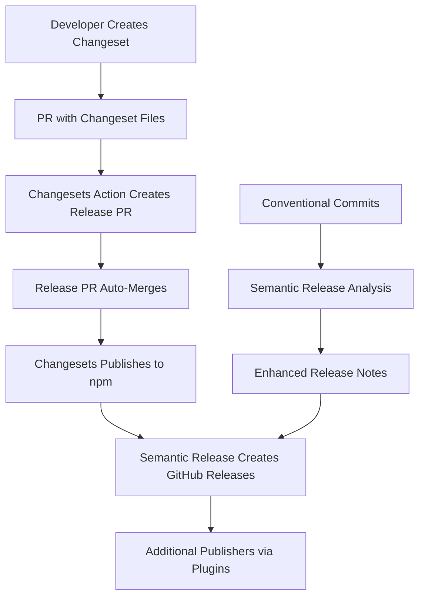

# Changesets Workflow Integration

This guide explains how `@bfra.me/semantic-release` integrates with the Changesets workflow in monorepo environments, providing coordinated releases, automated versioning, and comprehensive changelog management.

## Table of Contents

- [Overview](#overview)
- [Understanding the Integration](#understanding-the-integration)
- [Configuration](#configuration)
- [Workflow Patterns](#workflow-patterns)
- [Setup Guide](#setup-guide)
- [Real-World Examples](#real-world-examples)
- [Advanced Patterns](#advanced-patterns)
- [Troubleshooting](#troubleshooting)
- [Migration from Changesets-Only](#migration-from-changesets-only)
- [Best Practices](#best-practices)

## Overview

The `@bfra.me/semantic-release` package provides seamless integration with Changesets workflows, combining the benefits of both tools:

- **Changesets**: Developer-friendly change tracking and version coordination
- **Semantic Release**: Automated publishing, GitHub releases, and advanced workflow capabilities

This integration is particularly powerful in monorepos where coordinated releases, package-specific configuration, and automated publishing workflows are essential.

### Key Benefits

| Feature | Changesets Only | With Semantic Release | Combined Benefits |
|---------|----------------|----------------------|-------------------|
| **Change Tracking** | ✅ Developer-friendly | ❌ Commit-based only | ✅ Best of both worlds |
| **Version Coordination** | ✅ Monorepo-aware | ⚠️ Limited | ✅ Enhanced coordination |
| **GitHub Releases** | ⚠️ Basic | ✅ Rich releases | ✅ Comprehensive releases |
| **CI/CD Integration** | ⚠️ Manual setup | ✅ Automated | ✅ Automated + coordinated |
| **Plugin Ecosystem** | ❌ Limited | ✅ Extensive | ✅ Extended capabilities |
| **Custom Publishers** | ❌ Not supported | ✅ Full plugin system | ✅ Unlimited publishing |

### Integration Architecture



## Understanding the Integration

The integration works by leveraging both tools in a coordinated workflow:

### Changesets Responsibilities

1. **Change Tracking**: Developers create changeset files describing changes
2. **Version Coordination**: Determines which packages need version bumps
3. **NPM Publishing**: Handles the actual package publishing to npm registry
4. **Version Management**: Updates package.json versions and creates release PRs

### Semantic Release Responsibilities

1. **GitHub Releases**: Creates rich GitHub releases with generated notes
2. **Release Notes**: Enhanced release notes using conventional commit analysis
3. **Additional Publishing**: Supports additional publishers (Docker, S3, custom)
4. **Workflow Automation**: Advanced CI/CD integration and plugin ecosystem
5. **Monorepo Optimization**: Package-specific configuration and conditional publishing

### Workflow Sequence

1. **Development Phase**:
   - Developers make changes and create changesets
   - Conventional commits provide additional context for release notes

2. **Release Preparation**:
   - Changesets action creates "Version Packages" PR
   - Semantic release configuration validates and prepares additional steps

3. **Release Execution**:
   - Changesets publishes packages to npm
   - Semantic release creates GitHub releases
   - Additional publishers execute (if configured)

4. **Post-Release**:
   - Success notifications and issue commenting
   - Additional integrations and webhooks

## Configuration

### Basic Monorepo Setup

The simplest way to integrate with changesets is using the `monorepoPreset` with `changesetsIntegration: true`:

```typescript
// release.config.mjs or .semantic-release.cjs
import { monorepoPreset } from '@bfra.me/semantic-release'

export default monorepoPreset({
  branches: ['main'],
  packageName: '@my-org/package-name',
  repositoryUrl: 'https://github.com/my-org/monorepo',
  pkgRoot: 'packages/package-name',
  changesetsIntegration: true,
  publishOnlyIfChanged: true
})
```

### Changesets Configuration

Ensure your `.changeset/config.json` is properly configured for monorepo publishing:

```json
{
  "$schema": "https://unpkg.com/@changesets/config@3.0.0/schema.json",
  "access": "public",
  "baseBranch": "main",
  "bumpVersionsWithWorkspaceProtocolOnly": true,
  "changelog": ["@svitejs/changesets-changelog-github-compact", {"repo": "my-org/monorepo"}],
  "commit": false,
  "fixed": [],
  "ignore": ["private-package", "docs"],
  "linked": [],
  "updateInternalDependencies": "patch"
}
```

### GitHub Actions Workflow

Configure your CI workflow to handle both changesets and semantic release:

```yaml
# .github/workflows/release.yaml
name: Release

on:
  push:
    branches: [main]
  schedule:
    - cron: '0 18 * * 0' # Weekly release window
  workflow_dispatch:

permissions:
  contents: write
  id-token: write
  pull-requests: write

jobs:
  release:
    runs-on: ubuntu-latest
    steps:
      - uses: actions/checkout@v4
        with:
          token: ${{ secrets.GITHUB_TOKEN }}

      - name: Setup Node.js
        uses: actions/setup-node@v4
        with:
          node-version: '20'
          cache: 'pnpm'

      - name: Install dependencies
        run: pnpm install --frozen-lockfile

      - name: Build packages
        run: pnpm build

      - name: Create Release Pull Request or Publish
        uses: changesets/action@v1
        with:
          version: pnpm changeset version
          publish: pnpm changeset publish
        env:
          GITHUB_TOKEN: ${{ secrets.GITHUB_TOKEN }}
          NPM_TOKEN: ${{ secrets.NPM_TOKEN }}

      # Semantic release runs after changesets publishes
      - name: Create GitHub Releases
        if: steps.changesets.outputs.published == 'true'
        run: pnpm semantic-release
        env:
          GITHUB_TOKEN: ${{ secrets.GITHUB_TOKEN }}
```

### Package Scripts

Add the necessary scripts to your root `package.json`:

```json
{
  "scripts": {
    "changeset": "changeset",
    "changeset:version": "changeset version && pnpm install --lockfile-only",
    "changeset:publish": "changeset publish",
    "semantic-release": "semantic-release"
  }
}
```

## Workflow Patterns

### 1. Standard Monorepo Workflow

**For most monorepos with coordinated releases:**

```typescript
// packages/core/release.config.mjs
import { monorepoPreset } from '@bfra.me/semantic-release'

export default monorepoPreset({
  branches: ['main'],
  packageName: '@my-org/core',
  repositoryUrl: 'https://github.com/my-org/monorepo',
  pkgRoot: 'packages/core',
  changesetsIntegration: true,
  publishOnlyIfChanged: true
})
```

**Workflow:**

1. Developer changes code and creates changeset
2. Changesets manages version bumps and npm publishing
3. Semantic release creates GitHub releases with enhanced notes
4. Success comments added to related issues/PRs

### 2. Independent Package Releases

**For packages that need independent release cycles:**

```typescript
// packages/utils/release.config.mjs
import { monorepoPreset, extendConfig } from '@bfra.me/semantic-release'

const baseConfig = monorepoPreset({
  branches: [
    'main',
    { name: 'beta', prerelease: true },
    { name: 'alpha', prerelease: 'alpha' }
  ],
  packageName: '@my-org/utils',
  repositoryUrl: 'https://github.com/my-org/monorepo',
  pkgRoot: 'packages/utils',
  changesetsIntegration: true,
  publishOnlyIfChanged: true
})

// Add custom release notes template
export default extendConfig(baseConfig, {
  plugins: [
    ...baseConfig.plugins.slice(0, -2), // All plugins except GitHub and Git
    [
      '@semantic-release/github',
      {
        releaseNameTemplate: '@my-org/utils@${nextRelease.version}',
        releaseBodyTemplate: `
## @my-org/utils@\${nextRelease.version}

\${nextRelease.notes}

### Installation

\`\`\`bash
npm install @my-org/utils@\${nextRelease.version}
\`\`\`

### Breaking Changes
\${nextRelease.type === 'major' ? 'This release contains breaking changes.' : 'No breaking changes.'}
        `,
        successComment: 'This ${issue.pull_request ? "PR is included" : "issue has been resolved"} in @my-org/utils@${nextRelease.version} :tada:'
      }
    ],
    baseConfig.plugins[baseConfig.plugins.length - 1] // Git plugin
  ]
})
```

### 3. Multi-Platform Publishing

**For packages that publish to multiple platforms:**

```typescript
// packages/cli/release.config.mjs
import { monorepoPreset, extendConfig } from '@bfra.me/semantic-release'

const baseConfig = monorepoPreset({
  branches: ['main'],
  packageName: '@my-org/cli',
  repositoryUrl: 'https://github.com/my-org/monorepo',
  pkgRoot: 'packages/cli',
  changesetsIntegration: true,
  publishOnlyIfChanged: true
})

export default extendConfig(baseConfig, {
  plugins: [
    ...baseConfig.plugins,
    // Add Docker publishing
    [
      '@semantic-release/exec',
      {
        publishCmd: 'docker build -t my-org/cli:${nextRelease.version} . && docker push my-org/cli:${nextRelease.version}'
      }
    ],
    // Add GitHub release assets
    [
      '@semantic-release/github',
      {
        assets: [
          { path: 'dist/*.tar.gz', label: 'Binary distributions' },
          { path: 'packages/cli/CHANGELOG.md', label: 'Changelog' }
        ]
      }
    ]
  ]
})
```

## Setup Guide

### Step 1: Install Dependencies

```bash
# Install changesets and semantic release
pnpm add -D @changesets/cli @bfra.me/semantic-release

# Install additional plugins as needed
pnpm add -D @semantic-release/github @semantic-release/git
```

### Step 2: Initialize Changesets

```bash
# Initialize changesets configuration
pnpm changeset init

# Configure for monorepo (edit .changeset/config.json)
```

### Step 3: Configure Semantic Release

Create configuration files for each package:

```typescript
// packages/my-package/release.config.mjs
import { monorepoPreset } from '@bfra.me/semantic-release'

export default monorepoPreset({
  branches: ['main'],
  packageName: '@my-org/my-package',
  repositoryUrl: 'https://github.com/my-org/monorepo',
  pkgRoot: 'packages/my-package',
  changesetsIntegration: true
})
```

### Step 4: Setup CI/CD Workflow

Create GitHub Actions workflow (see [GitHub Actions Workflow](#github-actions-workflow) above).

### Step 5: Configure Package Scripts

Update root `package.json` and individual package scripts:

```json
{
  "scripts": {
    "changeset": "changeset",
    "version-packages": "changeset version && pnpm install --lockfile-only",
    "publish-packages": "changeset publish",
    "release": "pnpm semantic-release"
  }
}
```

### Step 6: Test the Workflow

1. Create a test changeset:
   ```bash
   pnpm changeset
   ```

2. Test release configuration:
   ```bash
   pnpm semantic-release --dry-run
   ```

3. Commit and push to trigger CI workflow

## Real-World Examples

### Example 1: bfra.me/works Monorepo

The `bfra.me/works` monorepo uses this integration pattern:

**Changesets Configuration** (`.changeset/config.json`):
```json
{
  "$schema": "https://unpkg.com/@changesets/config@3.0.0/schema.json",
  "access": "public",
  "baseBranch": "main",
  "bumpVersionsWithWorkspaceProtocolOnly": true,
  "changelog": ["@svitejs/changesets-changelog-github-compact", {"repo": "bfra-me/works"}],
  "commit": false,
  "fixed": [],
  "ignore": ["@bfra.me/works", "docs"],
  "linked": [],
  "updateInternalDependencies": "patch"
}
```

**Package Configuration** (`packages/semantic-release/release.config.mjs`):
```typescript
import { monorepoPreset } from '@bfra.me/semantic-release'

export default monorepoPreset({
  branches: ['main'],
  packageName: '@bfra.me/semantic-release',
  repositoryUrl: 'https://github.com/bfra-me/works',
  pkgRoot: 'packages/semantic-release',
  changesetsIntegration: true,
  publishOnlyIfChanged: true
})
```

**Workflow Scripts** (`package.json`):
```json
{
  "scripts": {
    "changeset": "changeset",
    "version-changesets": "changeset version && pnpm bootstrap --no-frozen-lockfile && pnpm build",
    "publish-changesets": "changeset publish"
  }
}
```

### Example 2: Enterprise Monorepo with Custom Publishers

**Configuration for API client package:**
```typescript
// packages/api-client/release.config.mjs
import { monorepoPreset, extendConfig } from '@bfra.me/semantic-release'

const baseConfig = monorepoPreset({
  branches: [
    'main',
    { name: 'staging', prerelease: 'rc' },
    { name: 'develop', prerelease: 'dev' }
  ],
  packageName: '@enterprise/api-client',
  repositoryUrl: 'https://github.com/enterprise/platform',
  pkgRoot: 'packages/api-client',
  changesetsIntegration: true,
  publishOnlyIfChanged: true
})

export default extendConfig(baseConfig, {
  plugins: [
    ...baseConfig.plugins,
    // Publish TypeScript definitions to CDN
    [
      '@semantic-release/exec',
      {
        publishCmd: 'aws s3 sync dist/types s3://cdn.enterprise.com/types/@enterprise/api-client/${nextRelease.version}/'
      }
    ],
    // Notify Slack channels
    [
      '@semantic-release/slack',
      {
        notifyOnSuccess: true,
        notifyOnFail: true,
        slackWebhook: process.env.SLACK_WEBHOOK_URL,
        channel: '#releases'
      }
    ]
  ]
})
```

### Example 3: Multi-Package Coordinated Release

**For packages that should be released together:**

```typescript
// packages/core/release.config.mjs
import { monorepoPreset } from '@bfra.me/semantic-release'

export default monorepoPreset({
  branches: ['main'],
  packageName: '@platform/core',
  repositoryUrl: 'https://github.com/platform/monorepo',
  pkgRoot: 'packages/core',
  changesetsIntegration: true,
  publishOnlyIfChanged: true,
  releaseNotesTemplate: `
## @platform/core@\${nextRelease.version}

\${nextRelease.notes}

### Coordinated Release

This release is part of a coordinated update including:
- @platform/utils@\${process.env.UTILS_VERSION || 'latest'}
- @platform/types@\${process.env.TYPES_VERSION || 'latest'}

### Installation

\`\`\`bash
npm install @platform/core@\${nextRelease.version}
\`\`\`
  `
})
```

## Advanced Patterns

### 1. Conditional Publishing Based on Changes

```typescript
// packages/docs/release.config.mjs
import { monorepoPreset, extendConfig } from '@bfra.me/semantic-release'
import { readFileSync } from 'fs'

// Only publish if actual documentation changes exist
const hasDocsChanges = () => {
  try {
    const changeset = readFileSync('.changeset/*.md', 'utf8')
    return changeset.includes('packages/docs') || changeset.includes('documentation')
  } catch {
    return false
  }
}

const baseConfig = monorepoPreset({
  branches: ['main'],
  packageName: '@my-org/docs',
  repositoryUrl: 'https://github.com/my-org/monorepo',
  pkgRoot: 'packages/docs',
  changesetsIntegration: true,
  publishOnlyIfChanged: true
})

export default extendConfig(baseConfig, {
  plugins: [
    // Add conditional check
    [
      '@semantic-release/exec',
      {
        verifyConditionsCmd: hasDocsChanges() ? 'echo "Documentation changes detected"' : 'exit 1'
      }
    ],
    ...baseConfig.plugins
  ]
})
```

### 2. Environment-Specific Release Configuration

```typescript
// packages/app/release.config.mjs
import { monorepoPreset, mergeConfigs } from '@bfra.me/semantic-release'

const baseConfig = monorepoPreset({
  branches: ['main', 'staging'],
  packageName: '@my-org/app',
  repositoryUrl: 'https://github.com/my-org/monorepo',
  pkgRoot: 'packages/app',
  changesetsIntegration: true
})

const productionConfig = {
  plugins: [
    ...baseConfig.plugins,
    // Deploy to production
    [
      '@semantic-release/exec',
      {
        publishCmd: 'npm run deploy:production'
      }
    ]
  ]
}

const stagingConfig = {
  plugins: [
    ...baseConfig.plugins,
    // Deploy to staging
    [
      '@semantic-release/exec',
      {
        publishCmd: 'npm run deploy:staging'
      }
    ]
  ]
}

// Environment-specific configuration
export default process.env.NODE_ENV === 'production'
  ? mergeConfigs(baseConfig, productionConfig)
  : mergeConfigs(baseConfig, stagingConfig)
```

### 3. Cross-Package Release Coordination

```typescript
// scripts/coordinated-release.mjs
import { execSync } from 'child_process'
import { readFileSync, writeFileSync } from 'fs'

// Read all changesets to determine affected packages
const getAffectedPackages = () => {
  const changesetFiles = execSync('find .changeset -name "*.md" -not -name "README.md"', { encoding: 'utf8' })
    .split('\n')
    .filter(Boolean)

  const affectedPackages = new Set()

  changesetFiles.forEach(file => {
    const content = readFileSync(file, 'utf8')
    const frontmatter = content.match(/---\n([\s\S]*?)\n---/)
    if (frontmatter) {
      const packages = frontmatter[1].match(/"@[^"]+"/g)
      packages?.forEach(pkg => affectedPackages.add(pkg.replace(/"/g, '')))
    }
  })

  return Array.from(affectedPackages)
}

// Update cross-references in release notes
const updateCrossReferences = (packages) => {
  packages.forEach(pkg => {
    const configPath = `packages/${pkg.replace('@my-org/', '')}/release.config.mjs`
    // Update release configuration with cross-references
    // Implementation details...
  })
}

const affectedPackages = getAffectedPackages()
console.log('Coordinated release for packages:', affectedPackages)
updateCrossReferences(affectedPackages)
```

## Troubleshooting

### Common Issues and Solutions

#### 1. Duplicate Release Creation

**Problem**: Both changesets and semantic-release create releases

**Solution**: Use `changesetsIntegration: true` and disable npm publishing in semantic-release:

```typescript
import { defineConfig } from '@bfra.me/semantic-release'

export default defineConfig({
  branches: ['main'],
  plugins: [
    '@semantic-release/commit-analyzer',
    '@semantic-release/release-notes-generator',
    // Skip @semantic-release/npm - changesets handles this
    '@semantic-release/github',
    '@semantic-release/git'
  ]
})
```

#### 2. Version Mismatch Between Tools

**Problem**: Changesets and semantic-release calculate different versions

**Solution**: Let changesets control versioning, semantic-release handles additional publishing:

```typescript
import { monorepoPreset } from '@bfra.me/semantic-release'

export default monorepoPreset({
  // ... other config
  changesetsIntegration: true,
  publishOnlyIfChanged: true // Only run if changesets already published
})
```

#### 3. Missing Release Notes

**Problem**: Release notes are empty or not generated

**Solution**: Ensure conventional commits are used alongside changesets:

```typescript
export default monorepoPreset({
  // ... other config
  changesetsIntegration: true,
  // Custom release notes that combine both sources
  releaseNotesTemplate: `
## Release Notes

### Changes from Changesets
\${changeset.summary}

### Conventional Commit Analysis
\${nextRelease.notes}
  `
})
```

#### 4. CI/CD Pipeline Conflicts

**Problem**: Changesets and semantic-release steps conflict in CI

**Solution**: Run them sequentially, not in parallel:

```yaml
- name: Publish with Changesets
  id: changesets
  uses: changesets/action@v1
  # ... config

- name: Create GitHub Releases
  if: steps.changesets.outputs.published == 'true'
  run: pnpm semantic-release
```

#### 5. Package Not Publishing

**Problem**: Package version updated but not published

**Solution**: Check `publishOnlyIfChanged` setting and changeset configuration:

```typescript
export default monorepoPreset({
  changesetsIntegration: true,
  publishOnlyIfChanged: false, // Always attempt to publish
  // ... other config
})
```

### Debug Mode

Enable debug logging to troubleshoot issues:

```bash
# Changesets debug
DEBUG=changesets* pnpm changeset version

# Semantic release debug
DEBUG=semantic-release:* pnpm semantic-release --dry-run
```

### Validation Commands

```bash
# Validate changeset configuration
pnpm changeset status

# Validate semantic release configuration
pnpm semantic-release --dry-run --debug

# Check for version consistency
pnpm ls --depth=0
```

## Migration from Changesets-Only

If you're currently using changesets without semantic-release, here's how to migrate:

### Step 1: Assessment

```bash
# Check current changesets configuration
cat .changeset/config.json

# Review current release workflow
cat .github/workflows/release.yml
```

### Step 2: Install Semantic Release

```bash
pnpm add -D @bfra.me/semantic-release
```

### Step 3: Create Configuration Files

For each package in your monorepo:

```typescript
// packages/[package-name]/release.config.mjs
import { monorepoPreset } from '@bfra.me/semantic-release'

export default monorepoPreset({
  branches: ['main'],
  packageName: '@your-org/package-name',
  repositoryUrl: 'https://github.com/your-org/monorepo',
  pkgRoot: 'packages/package-name',
  changesetsIntegration: true,
  publishOnlyIfChanged: true
})
```

### Step 4: Update CI Workflow

Modify your existing GitHub Actions workflow:

```yaml
# Before (changesets only)
- name: Create Release Pull Request or Publish to npm
  uses: changesets/action@v1
  with:
    publish: pnpm changeset publish
  env:
    GITHUB_TOKEN: ${{ secrets.GITHUB_TOKEN }}
    NPM_TOKEN: ${{ secrets.NPM_TOKEN }}

# After (changesets + semantic-release)
- name: Create Release Pull Request or Publish to npm
  id: changesets
  uses: changesets/action@v1
  with:
    publish: pnpm changeset publish
  env:
    GITHUB_TOKEN: ${{ secrets.GITHUB_TOKEN }}
    NPM_TOKEN: ${{ secrets.NPM_TOKEN }}

- name: Create GitHub Releases
  if: steps.changesets.outputs.published == 'true'
  run: pnpm semantic-release
  env:
    GITHUB_TOKEN: ${{ secrets.GITHUB_TOKEN }}
```

### Step 5: Test the Migration

1. Create a test changeset
2. Run the workflow in dry-run mode
3. Verify both tools work together
4. Gradually roll out to production

### Migration Checklist

- [ ] Install `@bfra.me/semantic-release`
- [ ] Create configuration files for each package
- [ ] Update CI/CD workflow
- [ ] Test with dry-run mode
- [ ] Update package scripts
- [ ] Document new workflow for team
- [ ] Train team on new process
- [ ] Monitor first few releases

## Best Practices

### 1. Changeset Creation

**Create meaningful changesets:**
```bash
# Good changeset description
pnpm changeset
# Select packages: @my-org/core, @my-org/utils
# Impact: minor (new feature), patch (bug fix)
# Description: "Add new authentication helper and fix timezone bug"
```

**Use semantic commit messages alongside changesets:**
```bash
git commit -m "feat(auth): add OAuth2 helper function

Adds support for OAuth2 authentication flow with automatic token refresh.

Closes #123"
```

### 2. Release Configuration

**Use consistent configuration patterns:**
```typescript
// Base configuration for all packages
const createPackageConfig = (packageName: string, pkgRoot: string) =>
  monorepoPreset({
    branches: ['main'],
    packageName,
    repositoryUrl: 'https://github.com/my-org/monorepo',
    pkgRoot,
    changesetsIntegration: true,
    publishOnlyIfChanged: true
  })

// Individual package configs
export default createPackageConfig('@my-org/core', 'packages/core')
```

### 3. CI/CD Optimization

**Optimize build times:**
```yaml
- name: Build affected packages only
  run: |
    AFFECTED=$(pnpm changeset status --output=json | jq -r '.releases[].name')
    for package in $AFFECTED; do
      pnpm --filter=$package build
    done
```

**Cache between steps:**
```yaml
- name: Cache build artifacts
  uses: actions/cache@v3
  with:
    path: |
      **/lib
      **/dist
    key: build-${{ github.sha }}
```

### 4. Documentation

**Maintain up-to-date documentation:**
- Document changeset workflow for contributors
- Include semantic-release configuration in README
- Keep release notes templates current
- Document custom publisher configurations

### 5. Monitoring and Alerts

**Set up monitoring for releases:**
```typescript
export default extendConfig(baseConfig, {
  plugins: [
    ...baseConfig.plugins,
    [
      '@semantic-release/slack',
      {
        notifyOnSuccess: true,
        notifyOnFail: true,
        channel: '#releases'
      }
    ]
  ]
})
```

### 6. Security Considerations

**Secure token management:**
- Use environment-specific tokens
- Rotate tokens regularly
- Use minimal required permissions
- Audit token usage

**Validate releases:**
```typescript
export default extendConfig(baseConfig, {
  plugins: [
    [
      '@semantic-release/exec',
      {
        verifyConditionsCmd: 'npm audit --audit-level=moderate',
        prepareCmd: 'npm run validate'
      }
    ],
    ...baseConfig.plugins
  ]
})
```

### 7. Team Workflow

**Establish clear guidelines:**
1. Always create changesets for user-facing changes
2. Use conventional commits for additional context
3. Review changesets in PR reviews
4. Monitor release pipelines for failures
5. Communicate breaking changes clearly

**Training checklist:**
- [ ] Changeset creation process
- [ ] Semantic commit message format
- [ ] Release pipeline understanding
- [ ] Troubleshooting common issues
- [ ] Emergency rollback procedures

---

This integration between changesets and semantic-release provides a powerful, flexible foundation for monorepo release management, combining developer-friendly change tracking with automated publishing and rich release experiences.
